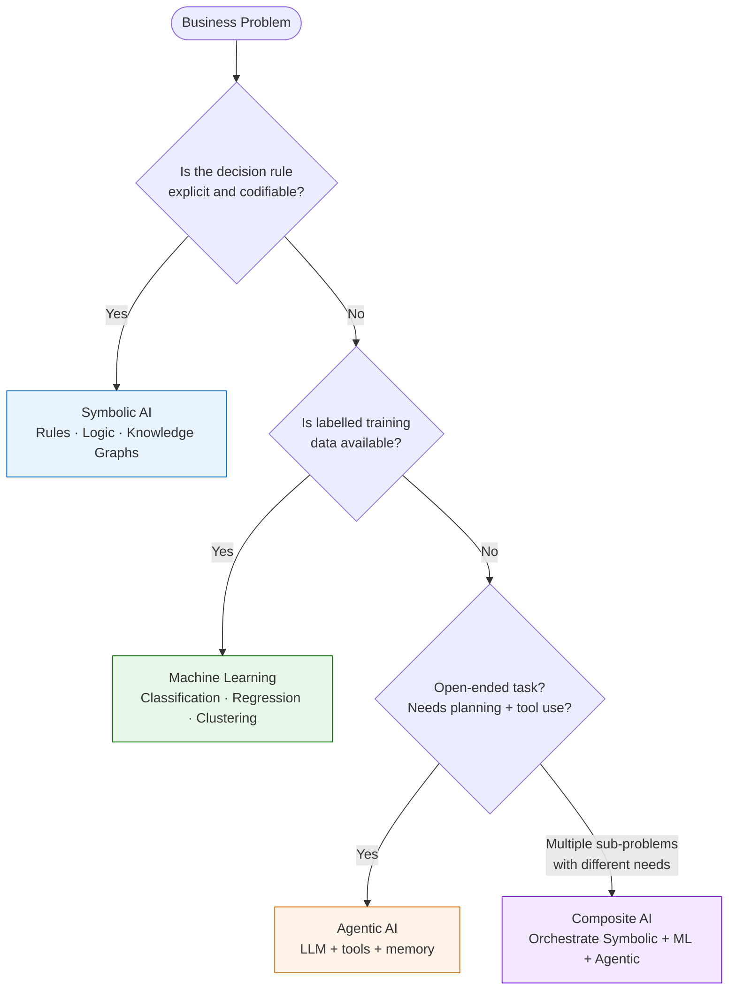

# AI Paradigms

A four-way cut surfaced in [[course-04-session-01-20250920-overview|Course_04 Session 01]] used to position AI approaches:

| Paradigm | Core idea | Typical problem fit |
|---|---|---|
| **Symbolic AI** | Explicit rules, logic, knowledge graphs | Compliance checking, regulatory logic |
| **Machine Learning** | Statistical learning from data | Classification, regression, clustering |
| **Agentic AI** | LLM-driven planning + tool use | Open-ended tasks, research assistants |
| **Composite AI** | Hybrid of the above, orchestrated per sub-problem | Real-world applications where no single approach fits |

## Paradigm Selection Guide

## Applied example

In [[concepts/vibe-coding|the vibe-coding fraud-detection demo]], the Agentic AI path delegated fraud detection to LLMs directly; the Composite AI path combined symbolic rules, ML classifiers, and GenAI. The deck compared the two paths on the same train/test split.

## Why DBA candidates should care

Different business functions fit different paradigms — see [[concepts/ai-in-business-functions|AI in business functions]]. Research-grade work should justify paradigm selection with respect to the problem structure ^[inferred].

## Paradigm selection in practice

Paradigm choice is *part of* AI strategy, not the starting point. The [[concepts/ai-project-strategy|AI Project Strategy]] framework (Course 07) recommends removing the AI hat first to define strategy and decision logic — the paradigm surfaces naturally at Layer 2 once the business decision is clear. ^[inferred]

## Related

- [[concepts/vibe-coding|Vibe coding]]
- [[concepts/ai-in-business-functions|AI in business functions]]
- [[course-04-session-01-20250920-overview|Course_04 Session 01]]
- [[ai-in-business-functions|AI in Business Functions]]
- [[doctoral-research-methodology|Doctoral Research Methodology]]
- [[concepts/ai-project-strategy|AI Project Strategy]] — strategic layer above paradigm selection
