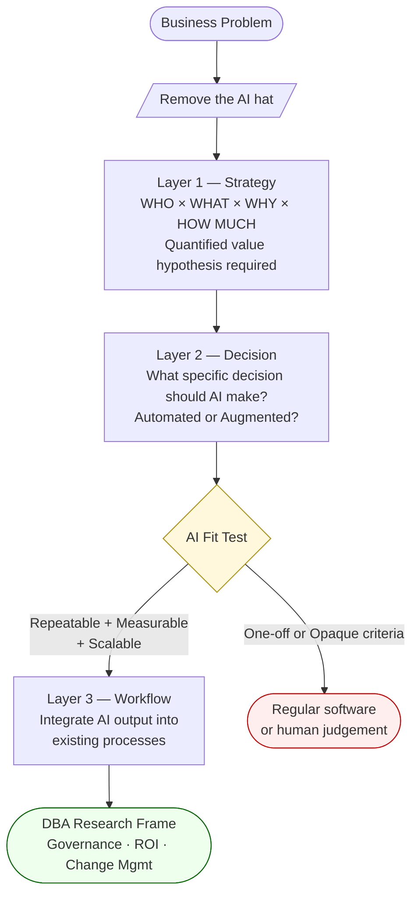
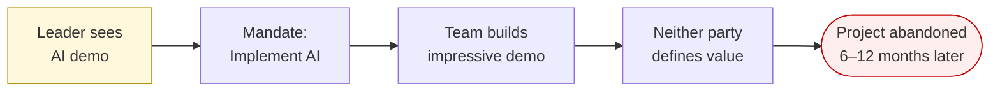

# AI Project Strategy

Introduced by [[prof-dakshina-morti|Prof. Morty]] in [[course-07-overview-ai-project-design-and-execution|Course 07]]. The central challenge: most AI failures are not execution failures — they are planning failures. The framework shifts practitioners from "AI Crush" to deliberate AI strategy.

## The Core Problem: AI Crush

**AI Crush** = enthusiasm for AI technology without strategic grounding.

Pattern:
1. Leader attends conference, sees demo, gets excited
2. Mandate: "implement this AI"
3. Team builds impressive demo to satisfy mandate
4. Neither party defines business value
5. Project abandoned 6–12 months later

> "AI initiatives are not failing during development. They are failing even before the process started because they are so poorly thought through and designed."

**Statistics** (Prof. Morty's estimate based on consulting experience):
- 90% of AI projects fail to deliver value
- 60–65% of those failures: problem selection and planning
- ~25%: execution (data, cost, technical drift)

## The 3-Layer Framework

Remove the AI hat. Start with business:

### Layer 1 — Strategy
Define what business goal you are pursuing. A good strategy answers:
- **WHO** is affected?
- **WHAT** change do you want?
- **WHY** is this a priority?
- **HOW MUCH** (quantified)?

| Quality | Example |
|---|---|
| Poor | "Use AI in customer service" |
| Average | "Increase customer retention by 10%" |
| Good | "Increase retention of top 10% revenue customers by 10% in Q2 by improving onboarding experience" |

### Layer 2 — Decision
Once strategy is clear, ask: *what specific decisions should AI make?*
- **Automated decision**: AI acts without human approval
- **Augmented decision**: AI provides recommendation, human decides

The role of AI in the solution surfaces naturally here — not imposed upfront.

**AI fit test** (when is AI the right tool?):
- Repeatable and clearly measurable ✓
- Needs to scale ✓
- Opaque criteria or one-off → regular software or human judgement is better

### Layer 3 — Workflow
How does the AI output integrate into existing human workflows?
- Which system surface? (CRM, email, separate portal?)
- What does the employee do when AI gives a recommendation?
- What change management is needed?

Classic trap: defining layers 1 and 2 but forgetting layer 3. Example: built a churn predictor → achieved 10× precision improvement → client had no idea what to do with the prediction. Two completely separate problems (predict churn, act on churn prediction) never defined upfront.

## Strategic Objectives Format

From [[course-07-session-02-summary|Session 02]]:

> **WHO** I impact × **WHAT** decision × **WHICH** workflow × **WHEN** × **WHY** value

Mandatory elements:
- Quantified value hypothesis ("10% reduction in churn", "5% increase in revenue")
- Named segment (not "customers" — "top 10% customers by revenue")
- Specified workflow touch-point
- Specific decision type (automated vs. augmented)

Language to avoid: *"significant", "tremendous", "unbelievably", "massive improvement"* — all vague adjectives that weaken a strategic objective.

## AI Crush Pattern

## Prioritisation Rubric

When multiple AI opportunities exist, score each on:
- **Gain** — quantified business value if solved
- **Pain** — technology readiness + data readiness + change management effort

Priority = best combination of high gain, low pain. R&D problems often rank third but are long-term high-impact.

## AI Hype Cycle Risk

Prof. Morty's concern: current LLM hype mirrors the 1959 perceptron hype and the 1990s neural net hype — both led to multi-year AI winters when expectations weren't met. Responsible AI strategy (defined problems, measurable goals) is not just good practice — it's necessary to prevent the next AI winter.

## Related

- [[course-07-session-01-summary|Course 07 Session 01]] — source session for this framework
- [[course-07-session-02-summary|Course 07 Session 02]] — strategic objectives workshop details
- [[prof-dakshina-morti|Prof. Dakshina Morti V Kuru]]
- [[concepts/ai-in-business-functions|AI in Business Functions]] — application catalog
- [[concepts/doctoral-research-methodology|Doctoral Research Methodology]] — DBA thesis framing
- [[concepts/ai-paradigms|AI Paradigms]] — the technical layer below strategy
