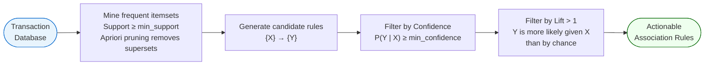

# Association Rule Mining (ARM)

An **unsupervised learning** technique for discovering frequently co-occurring items in transaction data. Output: if-then rules of the form `{antecedent} → {consequent}`. The canonical algorithm is **Apriori** (proposed 1994).

## The Apriori Pipeline



## Rule Anatomy

```
{Diapers, Male, Age=30-40, Day=Friday} → {Beer}
    antecedent (LHS)                      consequent (RHS)
```

- **Itemset** — the full set of items {antecedents ∪ consequents}
- **Rule length** — number of antecedents

## Key Metrics

| Metric | Formula | Interpretation |
|---|---|---|
| **Support** | P(X ∩ Y) | How often the itemset appears overall |
| **Confidence** | P(Y\|X) = Supp(X∪Y) / Supp(X) | How often Y appears when X appears |
| **Lift** | Confidence / P(Y) | How much more likely Y given X vs random; Lift > 1 = positive association |

**Apriori principle**: if an itemset is infrequent (below min support), all its supersets are also infrequent — allows pruning the search space.

## Classic Examples

- **Walmart diapers + beer** (1990s): men 30-40 buying diapers on Friday evenings were most likely to also buy beer. Lift = high.
- **Strawberry Pop-Tarts + hurricanes** (Walmart Florida, 2004): Pop-Tart sales had a lift of 7× over normal days before a hurricane.

## Applications

Retail cross-selling and store layout, medical co-diagnosis (symptom–disease associations), IT web navigation (page X → page Y), insurance fraud detection (unusual claim combinations), CRM product bundling.

## Related

- [[clustering|Clustering]] — co-taught alongside ARM in Course 04 Session 12
- [[ai-paradigms|AI Paradigms]] — ARM sits in the unsupervised / pattern-recognition block
- [[course-04-session-12-20251026-arm-clustering|Session 12 Slides]]
- [[dr-sridhar-pappu|Dr. Sridhar Pappu]]
