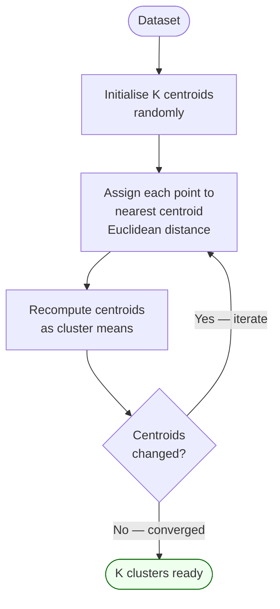

# Clustering

An **unsupervised learning** technique that groups observations so that intra-cluster similarity is high and inter-cluster similarity is low. No labelled target variable — the algorithm discovers structure in the data.

## K-Means (Partitional)

Proposed: 1957. User specifies K (number of clusters).

Algorithm:
1. Initialise K centroids randomly
2. Assign each point to nearest centroid (Euclidean distance by default)
3. Recompute centroids as mean of assigned points
4. Repeat steps 2-3 until convergence

**Choosing K**: Elbow method (plot within-cluster SSE vs K; choose the "elbow"); Silhouette score.

**Variants**: K-Medians (robust to outliers), K-Modes (for categorical data).

**Limitation**: assumes spherical clusters; sensitive to initialisation; K must be specified in advance.

## Agglomerative Hierarchical Clustering

Bottom-up: starts with N singleton clusters; repeatedly merges the two closest clusters until one remains. Produces a **dendrogram** — K can be chosen after the fact by cutting at any level.

Linkage criteria (how to measure cluster-cluster distance):
- Single linkage — minimum pairwise distance (chaining effect)
- Complete linkage — maximum pairwise distance (compact clusters)
- Average linkage — mean pairwise distance
- Ward's method — minimise within-cluster variance increase

## Distance Measures for Mixed Data

| Variable type | Distance measure |
|---|---|
| Numeric | Normalised Manhattan: \|xᵢ−xⱼ\| / range |
| Binary/Nominal | 0 if same, 1 if different |
| Ordinal | Normalised rank difference |
| Aggregate | Mean across all variables |

## Business Applications

Customer segmentation, spam filtering, driver behaviour profiling, news article grouping, gene expression analysis, document retrieval clustering.

## Related

- [[association-rule-mining|Association Rule Mining]] — co-taught alongside clustering in Course 04 Session 12
- [[ai-paradigms|AI Paradigms]] — clustering sits in the unsupervised learning block
- [[course-04-session-12-20251026-arm-clustering|Session 12 Slides]]
- [[course-04-session-13-20251101-clustering-ensemblemethods|Session 13 Slides]]
- [[dr-sridhar-pappu|Dr. Sridhar Pappu]]
