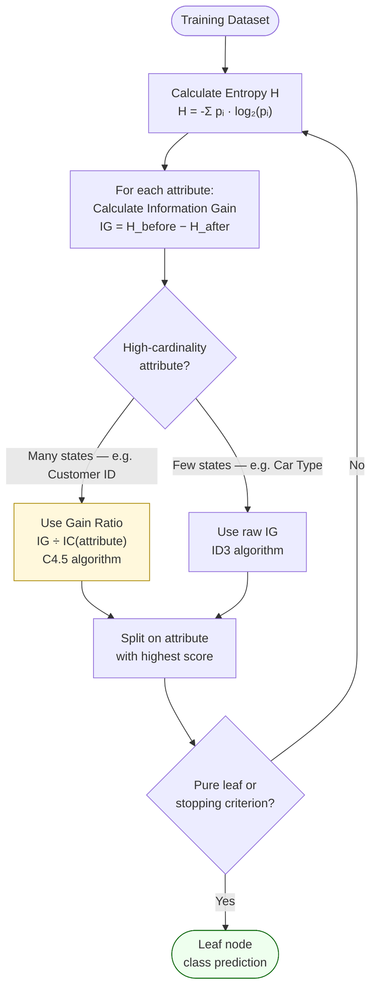

# Decision Trees

A **supervised learning** model that recursively partitions data by splitting on feature thresholds, producing a tree of if-then rules. Proposed in 1972. Used for both **classification** (Classification Trees) and **regression** (Regression Trees).

## How They Work

At each node, the algorithm selects the feature and split point that best separates the target:
- Classification: maximise information gain (entropy reduction) or Gini impurity reduction
- Regression: minimise within-node variance (SSE)

Splitting continues until a stopping criterion is met (max depth, min samples per leaf, or purity threshold).

## Key Properties

- **Interpretable** — the path from root to leaf is a human-readable rule
- **Non-parametric** — no distributional assumptions
- **Handles mixed data** — works with both numeric and categorical features natively
- **Prone to overfitting** — deep trees memorise training data; controlled via pruning or max depth

## Strengths vs Limitations

| Strengths | Limitations |
|---|---|
| Highly interpretable | High variance — small data changes produce very different trees |
| No feature scaling needed | Struggles with linear relationships |
| Handles missing data | Prone to overfitting without regularisation |

## The ID3 Algorithm

## Information Gain and the High-Cardinality Problem

The standard split criterion is **Information Gain (IG)**:

`IG(attribute) = H(before split) − H(after split)`

where H is entropy: `H = −Σ pᵢ · log₂(pᵢ)`

**Pitfall (ID3 algorithm)**: attributes with many distinct values (e.g., Customer ID with 20 states) will almost always score the highest IG, because each leaf ends up nearly pure — but purely by memorising individual records, not by learning a pattern. This produces severe overfitting.

**Remedy: Gain Ratio** (used in C4.5) = IG / IC(attribute)

where IC(attribute) = `−Σ pᵢ · log₂(pᵢ)` over the attribute's own distribution of values.

| Attribute | States | IC | Gain Ratio effect |
|---|---|---|---|
| Customer ID | 20 | 4.32 bits | Divided down — penalised for cardinality |
| Car Type | 3 | 1.52 bits | Gains relative to IC — rewarded if genuinely predictive |

Alternative: **CART** uses Gini impurity instead of entropy, which behaves similarly but avoids the log computation.

### Wordle as an Intuition Pump

Each Wordle guess is like an attribute split: a good guess eliminates the most candidates (maximises expected entropy reduction). The best opening guess (e.g. "CRANE") isn't the one that guarantees a specific answer — it's the one that maximises expected information across all 2,315 possible words. This maps exactly to IG maximisation at a decision tree node.

## Relationship to Ensembles

Single decision trees have high variance (the SUB/COV tradeoff — see [[course-04-session-09-session-09-18oct2025|Session 09]]). [[ensemble-methods|Ensemble methods]] (Random Forest, boosting) combine many trees to dramatically reduce variance and improve accuracy.

## Related

- [[ai-paradigms|AI Paradigms]] — sits in the supervised classification block
- [[ensemble-methods|Ensemble Methods]] — Random Forest and XGBoost build on decision trees
- [[logistic-regression|Logistic Regression]] — probabilistic alternative
- [[course-04-session-02-20250921-overview-mlterminology|Session 02 Slides]] — ML taxonomy overview
- [[course-04-session-09-session-09-18oct2025|Session 09]] — bias-variance tradeoff, tree intro
- [[course-04-session-10-session-10-19oct2025|Session 10]] — entropy, ID3, Gain Ratio, KNN
