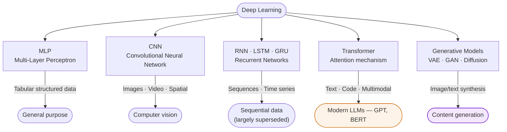

# Deep Learning

**Deep Learning** is machine learning on **unstructured data** (images, text, audio, video) using Artificial Neural Networks (ANNs) with many hidden layers. The "depth" refers to the number of layers — deeper networks learn progressively more abstract representations.

## Three Enablers (Why Now)

1. **Massive datasets** — billions of labelled examples (ImageNet, Common Crawl, etc.)
2. **Multi-core GPU compute** — parallelism makes training feasible; TPUs further accelerate
3. **Algorithmic advances** — backpropagation, dropout, batch normalisation, attention mechanisms, transformers

## ANN Scale Timeline

| Era | Parameters | Milestone |
|---|---|---|
| 1955 | 5–10 | Perceptron |
| 1985 | 50–500 | Backpropagation |
| 2005 | 5K–50K | Deep architectures |
| 2015 | 500K–10M | ImageNet breakthroughs |
| 2020 | 50M–200M | BERT, GPT-2 |
| 2024 | 1B–3T | GPT-4, Gemini |

## Architecture Taxonomy

## Key Architectures

- **MLP (Multi-Layer Perceptron)** — dense layers; general-purpose [[deep-learning|foundation]]
- **CNN (Convolutional Neural Network)** — spatial hierarchy; images, video
- **RNN / LSTM** — sequential data; time series, text (largely superseded by transformers)
- **Transformer** — attention mechanism; text, code, multimodal — basis of all modern LLMs
- **Generative models** — VAEs, GANs, diffusion models, autoregressive LLMs

## Characteristic Properties

- **ML on unstructured data** — the defining feature vs classical ML
- **Feature learning** — the network learns its own features from raw data (no hand-engineering)
- **Expensive to train, cheap to run** — large upfront compute; inference is fast once trained
- **Mostly non-interpretable** — black-box (though attention weights provide partial insight)

## Related

- [[ai-paradigms|AI Paradigms]] — deep learning is the third paradigm, extending ML to unstructured data
- [[transfer-learning|Transfer Learning]] — reusing pre-trained deep models for new tasks
- [[vibe-coding|Vibe Coding]] — LLM-orchestrated development built on deep learning foundations
- [[course-05-session-01-20251115-dl-c8s1-introduction|Course 05 Session 01 Slides]]
- [[course-05-session-02-20251116-dl-c8s1-multi-layer-perceptron|Course 05 Session 02 Slides — MLP]]
- [[dr-srinivasa-varadharajan|Dr. Srinivasa Varadharajan]] — Course 05 instructor
