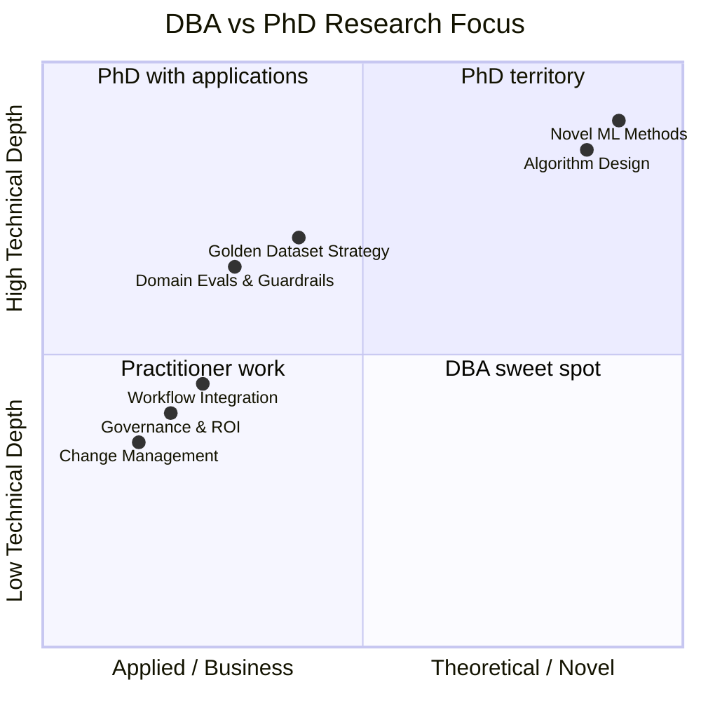
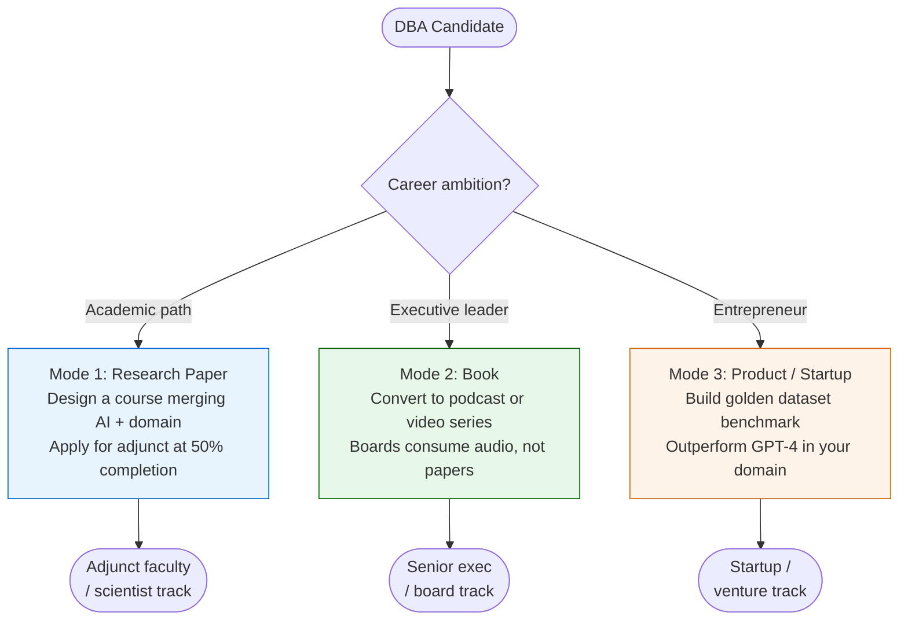

# Doctoral Research Methodology

Two major sources: [[course-03-session-01-transcript|Course_03 Session 01]] by [[dr-sumitra-padman|Dr. Sumitra Padman]] and [[course-07-session-02-summary|Course_07 Session 02]] by [[prof-dakshina-morti|Prof. Morty]].

The hardest part of a doctoral programme is topic identification; once the topic is clear, the rest of the journey is comparatively smooth.

## The "why" test (Dr. Sumitra Padman)

A project becomes research when you can defend *why* your approach is the right one — repeatedly, from multiple stakeholder viewpoints:

- **What is the problem?** Project-level.
- **How will I solve it?** Project-level.
- **Why this method over alternatives?** Research-level.
- **Why should a reviewer agree?** Research-level.
- **Why is this the best fit for this context?** Research-level.

Sumitra's framing: imagine the reviewer is skeptical and keep iterating until the "why" is airtight.

## DBA vs PhD Scope (Prof. Morty, Course 07)

| DBA focus | PhD focus |
|---|---|
| Governance, ROI, process integration | Algorithm design, novel methods |
| Business practice applicability | Novelty in the technical literature |
| Implementation feasibility | Mathematical rigour |
| Guardrails, change management, trust | Deep ablation studies |

> "Algorithm is PhD work. Governance and implementation is the DBA work."

A DBA thesis *can* include deep technical work, but it must be anchored by a clear business objective. The committee will ask: *where is this relevant in the business, and how much money is at stake?*

## Three Thesis Output Modes

Select based on career ambition:

| Mode | Career path | Additional artifact to build |
|---|---|---|
| **Research paper** | Academic faculty / scientist | Design a course marrying AI + domain; apply for adjunct roles at 50% thesis completion |
| **Book** | Executive / senior leader | Convert to podcast or video series — boards consume audio, not papers |
| **Product / startup** | Entrepreneur | Golden dataset benchmark showing your model outperforms GPT-4/Gemini in your domain |

## Choosing the Thesis Problem

Guidelines from Prof. Morty:
1. **Marry AI to domain expertise** — unless driven by external passion, combine your professional domain with AI methods
2. **Highly focused problems** — narrow, specific, high-impact is better than broad
3. **Advisor complementarity** — advisor brings AI strength, you bring domain strength; play to both
4. **Business frame is mandatory** — "nobody else studied this" works for PhD; for DBA, you must show hundreds of millions of dollars are at stake

**High-value problem types for DBA**:
- Domain-specific **evals** for GenAI (evaluation frameworks tied to your industry)
- **Guardrails and governance** for responsible AI in your domain
- **Change management and adoption** — human resistance to AI in the enterprise
- **Workflow integration** — how AI fits into existing business processes

## Golden Dataset Strategy (Product Mode)

Prof. Morty's own approach:
1. Pick a regulated domain with high technical complexity
2. Build a gold-standard Q&A dataset for that domain
3. Demonstrate a small specialised model (20–50B) outperforms GPT-4/Gemini on that benchmark
4. Quantify: *20–30× above its weight limit*

## Practical advice

- **Start topic identification from day one** of the 3-year programme.
- **Publishable assignments** — do literature reviews early so assignments can double as survey papers.
- **Peer learning** — cohort-internal discussion groups share research directions.
- At 50% thesis completion: if pursuing academic track, start applying for adjunct faculty positions.

## Related

- [[course-03-overview-emerging-digital-technologies|Course_03 — Emerging Digital Technologies]]
- [[course-07-session-02-summary|Course 07 Session 02]] — primary source for thesis framework
- [[concepts/ai-project-strategy|AI Project Strategy]] — the strategic objectives framework, applicable to thesis scoping
- [[concepts/emerging-digital-technologies|Emerging digital technologies]] — domain landscape for DBA topics
- [[dr-sumitra-padman|Dr. Sumitra Padman]]
- [[prof-dakshina-morti|Prof. Dakshina Morti V Kuru]]
