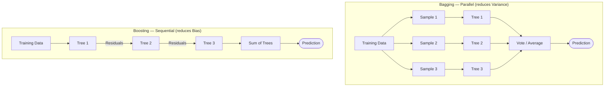

# Ensemble Methods

The core insight: combining predictions from multiple diverse models almost always outperforms any single model. Two fundamental strategies:

## Bagging vs Boosting at a Glance

## Bagging (Bootstrap Aggregating)

Train models on different **bootstrap samples** (random with replacement) of the training data; combine via majority vote (classification) or averaging (regression).

- Reduces **variance** without significantly increasing bias
- Models are trained **in parallel** — independent of each other
- **Random Forest** (Leo Breiman, 2001) extends bagging with an additional twist: at each tree split, only a random subset of features is considered. Double randomisation (row sampling + feature sampling) creates diverse trees with low correlation → stronger ensemble.

## Boosting

Train models **sequentially**, each focusing on the errors of the previous:

- **AdaBoost** — upweights misclassified samples for the next model
- **Gradient Boosting** — fits the *residuals* (gradient of loss) of the previous model
- **XGBoost** — regularised gradient boosting; state-of-the-art for tabular data; fastest convergence

Boosting reduces **bias** (helps underfitting); risk of overfitting on noisy data.

## Bias-Variance Trade-off Summary

| Method | Reduces | Risk |
|---|---|---|
| Bagging / Random Forest | Variance (overfitting) | None significant |
| Boosting / XGBoost | Bias (underfitting) | Overfitting on noisy data |

## Feature Importance

Random Forest provides a natural **feature importance** ranking (by mean decrease in impurity across all trees) — valuable for interpretability in business settings.

## Related

- [[decision-trees|Decision Trees]] — base learner for both Random Forest and gradient boosting
- [[ai-paradigms|AI Paradigms]] — ensemble methods sit in the supervised ML block
- [[course-04-session-09-session-09-18oct2025|Session 09]] — bias-variance tradeoff introduced (SUB/COV mnemonics); motivation for why ensembles exist
- [[course-04-session-13-20251101-clustering-ensemblemethods|Session 13 Slides]]
- [[dr-sridhar-pappu|Dr. Sridhar Pappu]]
