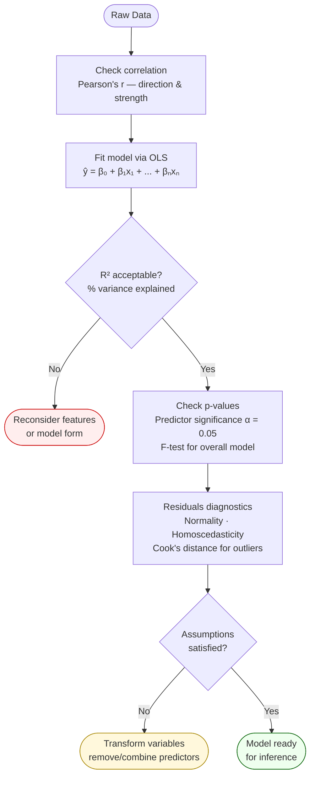

# Linear Regression

A **supervised learning** algorithm that models the relationship between one or more independent variables (features) and a continuous dependent variable (target) as a linear equation:

`ŷ = β₀ + β₁x₁ + β₂x₂ + ... + βₙxₙ`

Parameters (β coefficients) are estimated by minimising the **Sum of Squared Errors (SSE)** — ordinary least squares (OLS).

## Modeling Workflow

## Model Fit Diagnostics

| Check | Metric | What it measures |
|---|---|---|
| Overall fit | **R²** | % of target variance explained by predictors |
| Predictor significance | **p-value** (t-test) | Is slope ≠ 0? Use α = 0.05 |
| Model significance | **F-test (ANOVA)** | Is the model better than just predicting the mean? |
| Residual normality | Q-Q plot | Errors should be normally distributed |
| Homoscedasticity | Scale-location plot | Constant error variance across fitted values |
| Influential points | Cook's distance | Single observations unduly distorting the fit |

## Key Concepts

- **Pearson's r** — correlation coefficient (−1 to +1) measuring strength and direction of linear relationship before fitting
- **Adjusted R²** — penalises R² for adding unnecessary predictors; use for multi-predictor model comparison
- **Multicollinearity** — high inter-predictor correlation; inflates standard errors; detect via VIF; remedy: remove/combine predictors
- **Spurious regression** — high R² with no causal link; domain knowledge essential (e.g. stopping distance is quadratic, not linear, in speed)
- **Categorical predictors** — encoded as k−1 binary dummy variables to avoid the dummy-variable trap

## Worked Example: N95 Masks vs Sanitizers (Session 03)

Two inventory lines with **identical means** (791.8 units/week) but very different spread:
- N95 Masks: high variance → erratic, hard to stock
- Sanitizers: low variance → stable, predictable

The practical implication: R² alone doesn't tell you whether a regression model is operationally useful — distributional spread matters for decision-making under uncertainty. Before fitting a regression, always examine the distribution of the target variable.

## Business Applications

Salary estimation, CLV prediction, supply chain demand forecasting, software cost estimation, advertising spend optimisation.

## Related

- [[ai-paradigms|AI Paradigms]] — linear regression sits in the supervised / regression block
- [[logistic-regression|Logistic Regression]] — the classification analogue
- [[course-04-session-03-session-03-27sep2025|Session 03]] — descriptive statistics intro, N95/Sanitizer example
- [[course-04-session-05-20251004-linearregression|Session 05 Slides]] — full derivation and diagnostics
- [[course-04-session-06-20251005-linearregression|Session 06 Slides]] — multiple regression, transformations, metrics
- [[dr-sridhar-pappu|Dr. Sridhar Pappu]] — Course 04 instructor
