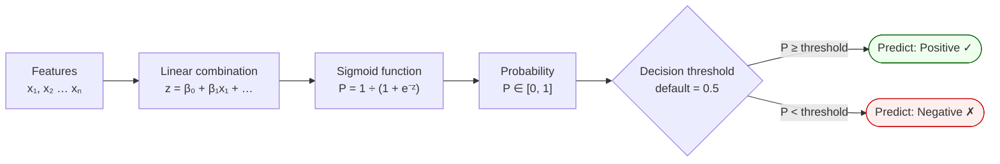

# Logistic Regression

A **supervised classification** algorithm. Linear regression fails for classification because its output is unbounded (−∞ to +∞), but probabilities must lie in [0, 1]. The **sigmoid (logistic) function** provides this mapping:

`P(Y=1|X) = 1 / (1 + e^(−(β₀ + β₁x₁ + ...)))`

Parameters are estimated by **Maximum Likelihood Estimation (MLE)**, not least squares.

## Prediction Pipeline

**Threshold tuning:** lower it → catches more positives (↑ Recall, ↓ Precision). Raise it → fewer false alarms (↑ Precision, ↓ Recall). Tune for business context.

## Classification Metrics

| Metric | Formula | Use when… |
|---|---|---|
| **Accuracy** | (TP+TN) / N | Classes are balanced |
| **Precision** | TP / (TP+FP) | False positives are costly |
| **Recall (Sensitivity)** | TP / (TP+FN) | False negatives are costly (e.g., disease screening) |
| **F1-Score** | 2 × Precision × Recall / (P+R) | Balanced trade-off |
| **ROC-AUC** | Area under sensitivity vs (1−specificity) curve | Model ranking ability across all thresholds |

## Decision Threshold

Default = 0.5. Lowering increases recall (catches more positives) but reduces precision. Tune for business context — e.g., fraud detection may tolerate more false positives to avoid missed fraud.

## Class Imbalance

When positives are rare (fraud, disease), accuracy is misleading. Remedies: adjust threshold, use precision-recall curve, SMOTE oversampling, class weights.

## Related

- [[linear-regression|Linear Regression]] — regression analogue; motivation for why regression fails at classification
- [[decision-trees|Decision Trees]] — non-probabilistic alternative for classification
- [[ensemble-methods|Ensemble Methods]] — random forest and boosting improve on single logistic models
- [[course-04-session-07-20251011-logisticregression-classificationmetrics|Session 07 Slides]]
- [[dr-sridhar-pappu|Dr. Sridhar Pappu]]
