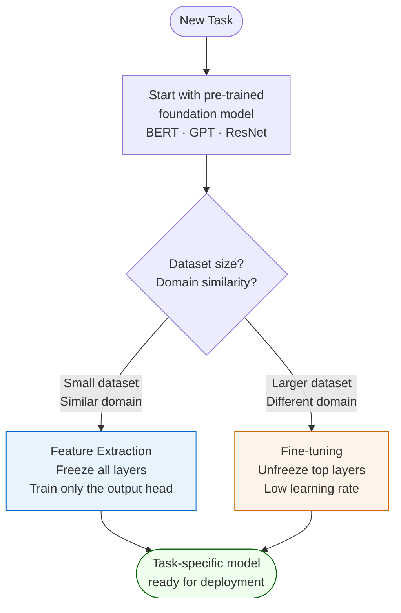

# Transfer Learning

**Transfer Learning** reuses the internal representations (weights) learned by a model trained on a large dataset to solve a different but related task — typically with far less data.

## Intuition

A deep model trained on millions of images (e.g. ImageNet) has learned to detect edges, textures, shapes, and objects. These features transfer to a new image classification task even if the new classes are completely different. Fine-tuning the last few layers with new labelled data is far cheaper than training from scratch.

## When to Use Which Mode

## Two Modes

| Mode | What you change | When to use |
|---|---|---|
| **Feature extraction** | Only retrain the final classification head; freeze all pre-trained layers | Small dataset; similar domain to pre-training data |
| **Fine-tuning** | Unfreeze some/all layers; train with a lower learning rate | Larger dataset; different domain; need higher accuracy |

## Why Transfer Learning Enables GenAI

Pre-trained foundation models (GPT, BERT, CLIP) have "looked at" so much data that they contain broadly useful world knowledge. Fine-tuning on a task-specific dataset (e.g. medical reports, legal documents) costs a fraction of pre-training. This is the economic basis of the LLM application economy.

## Key Examples

- **BERT** (Google, 2018) — pre-trained on Wikipedia + BooksCorpus; fine-tuned for NLP tasks
- **GPT series** (OpenAI) — pre-trained autoregressively; fine-tuned via RLHF for instruction-following
- **ResNet / EfficientNet** — ImageNet pre-trained weights used as feature extractors in medical imaging, satellite imagery, etc.

## Related

- [[deep-learning|Deep Learning]] — transfer learning is a training strategy within deep learning
- [[ai-paradigms|AI Paradigms]] — foundation models and composite AI paradigm rely heavily on transfer learning
- [[vibe-coding|Vibe Coding]] — LLMs powering vibe-coding are themselves products of transfer learning pipelines
- [[course-04-session-02-20250921-overview-mlterminology|Session 02 Slides]] — deep learning paradigm overview
- [[course-05-session-01-20251115-dl-c8s1-introduction|Course 05 Session 01 Slides]]
