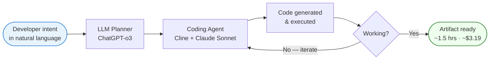

# Vibe Coding

A workflow in which the developer specifies intent in natural language and an LLM-backed coding agent generates, runs, and iterates on the implementation. The term surfaces in [[course-04-session-01-20250920-overview|Dr. Sridhar Pappu's Course_04 kickoff]] as the mechanism behind a 1.5-hour fraud-detection prototype.

## The Vibe Coding Loop

## Illustrative stack (Pappu demo)

| Layer | Tool |
|---|---|
| Orchestrator / planner | ChatGPT-o3 |
| IDE | Visual Studio Code |
| Coding agent | Cline |
| Primary LLM for code gen | Anthropic Claude Sonnet 4 |
| Secondary LLM | DeepSeek |
| Front-end | Streamlit |

Time: 1.5 hours. Cost: ~$3.19.

## Implications for DBA research

- Accelerates prototype phases in applied research — can move from problem statement to testable artifact in hours, not weeks ^[inferred].
- Opens methodological questions: reproducibility, model-version drift, cost vs. quality trade-offs, evaluation rigor ^[inferred].

## Related

- [[concepts/ai-paradigms|AI paradigms]] — vibe coding sits in the Agentic + Composite AI paradigm space
- [[course-04-session-01-20250920-overview|Course_04 Session 01]] — the source lecture
- [[doctoral-research-methodology|Doctoral Research Methodology]]
